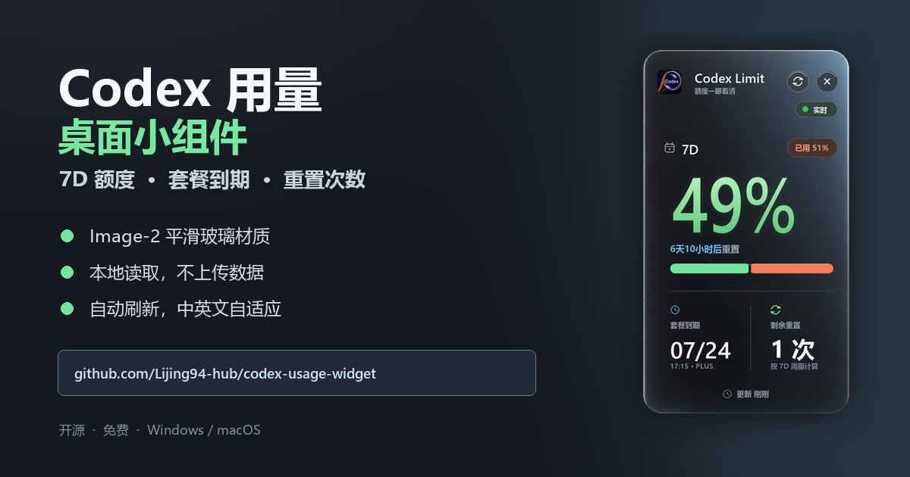
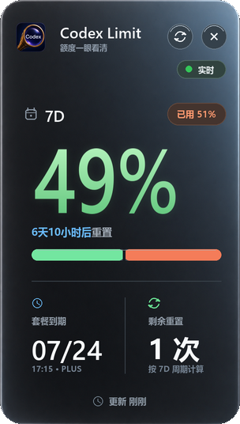
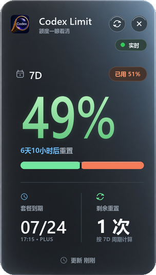
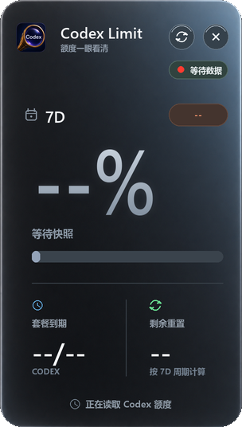
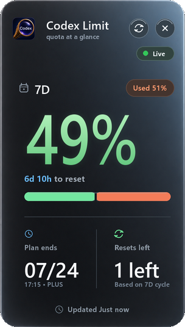
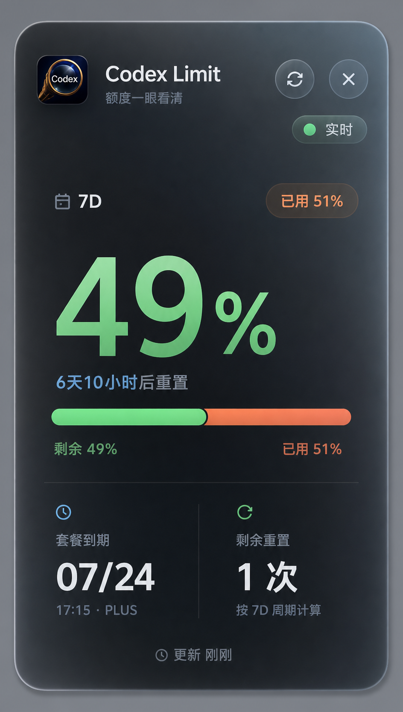
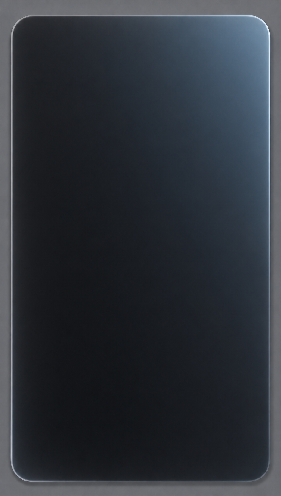

# Codex Usage Widget

<p align="center">
  
</p>

<p align="center">
  
  
  
</p>

<p align="center">
  <strong>A polished desktop widget for checking your local Codex usage limits at a glance.</strong>
  <br>
  <strong>一个用于查看 Codex 7D 用量、套餐到期和剩余重置次数的精致桌面小组件。</strong>
</p>

<p align="center">
  <a href="#windows-quick-start">Windows</a>
  |
  <a href="#macos-quick-start">macOS</a>
  |
  <a href="#privacy">Local only</a>
  |
  <a href="#run-tests">Tested</a>
  |
  <a href="docs/PROMOTION.md">Share Kit</a>
</p>

<p align="center">
  <a href="https://github.com/Lijing94-hub/codex-usage-widget/stargazers">
    
  </a>
</p>

Codex Usage Widget is built for people who keep Codex open all day and want quota awareness without opening dashboards, digging through logs, or guessing when the next reset happens.

中文用户可以把它当成一个常驻桌面的 Codex 额度看板：不用打开网页，不用翻日志，直接看 7D 剩余用量、套餐到期时间和到期前剩余重置次数。

It sits quietly on the desktop and keeps the account details that matter most large enough to read at a glance:

- `7D`: the weekly Codex quota
- Plan expiration from the local Codex login metadata
- Estimated resets remaining before expiration, based on the current 7-day cycle

The interface is intentionally compact and premium-feeling: a smooth Image-2-generated graphite glass material plate, Liquid Glass-inspired controls, high-DPI dynamic typography, rounded geometry, Codex branding, a semantic quota bar without duplicate labels, hover translucency, and a focused weekly-usage layout.

If this project helps you keep Codex usage visible, a GitHub Star helps more users discover it.

如果这个小组件对你有帮助，欢迎点一个 GitHub Star 支持一下。

## Download

Windows users can download the ready-to-run package from the latest release:

[Download CodexUsageWidget-Windows.zip](https://github.com/Lijing94-hub/codex-usage-widget/releases/latest/download/CodexUsageWidget-Windows.zip)

Unzip it, then double-click `CodexUsageWidget.exe`.

## Why It Feels Good

- Beautiful vertical desktop widget that can live near the edge of your screen
- Smooth Image-2 glass material integrated into the real renderer, not used as a static mockup
- Real local Codex limit snapshots, not mocked counters
- Big remaining-percentage typography for quick scanning
- Local plan expiration and estimated resets remaining before expiration
- Green remaining segment and orange used segment for instant visual understanding
- Hover glass mode, so you can inspect content underneath without fully hiding quota data
- Manual refresh, auto refresh, always-on-top mode, and drag-to-position
- Cache fallback when Codex has not written a fresh snapshot yet
- Clear reset/waiting state instead of disappearing or showing misleading values
- System language detection with Simplified Chinese and English UI text
- Windows startup install/uninstall scripts
- macOS launcher included for sharing with teammates
- Built-in tests for parsing, caching, stale windows, and UI rendering

## More Screenshots

| Live quota | Hover glass | Reset-safe state | English UI |
| --- | --- | --- | --- |
|  |  |  |  |

<details>
  <summary>Image-2 concept and production material</summary>
  <br>
  
  
  <p>The blank Image-2 material is loaded by the application itself; live quota data and controls are rendered above it at runtime.</p>
</details>

## Privacy

This widget only reads local Codex files under your own `~/.codex` directory.

It does not upload data, does not call a server, and does not read or display your conversation content. The UI only uses local rate-limit snapshots plus the plan type and subscription expiration already stored in the local Codex login metadata. Tokens are never displayed or copied into the widget cache.

## Windows Quick Start

Recommended for most users:

1. Download `CodexUsageWidget-Windows.zip` from the latest GitHub Release.
2. Unzip it.
3. Double-click `CodexUsageWidget.exe`.

Optional:

- Double-click `install-startup.cmd` from the unzipped folder to launch it automatically when Windows starts.
- Double-click `uninstall-startup.cmd` to remove startup launch.
- Windows may warn about unsigned apps. Choose to keep/open it if you trust this repository.

Developer/source mode:

1. Install Python 3.10+ if you do not already have it.
2. Install Pillow:

   ```powershell
   py -m pip install pillow
   ```

3. Double-click `start.cmd`.

Source-mode optional:

- Double-click `install-startup.cmd` to launch it automatically when Windows starts.
- Double-click `uninstall-startup.cmd` to remove startup launch.
- Right-click the widget for refresh, always-on-top, reset position, and quit.

## Build Windows Release

```powershell
build-windows.cmd
```

The packaged app will be written to `dist\CodexUsageWidget\CodexUsageWidget.exe`, and the uploadable archive will be written to `dist\CodexUsageWidget-Windows.zip`.

## macOS Quick Start

1. Install Python 3 if needed.
2. Double-click `start-mac.command`.
3. If macOS blocks it, right-click the file and choose Open.

The first launch creates a local `.venv` and installs Pillow automatically.

## Run Tests

Windows:

```powershell
run-tests.cmd
```

Cross-platform:

```bash
python codex_usage_widget.py --test --include-ui
```

## Data Sources

The widget reads local Codex runtime files, including:

- `~/.codex/logs_2.sqlite`
- `~/.codex/sessions/**/*.jsonl`

Successful snapshots are cached locally so the widget can keep showing the last known value if Codex has not emitted a new limit event yet.

Cache locations:

- Windows: `%APPDATA%\CodexUsageWidget\limit_sample.json`
- macOS: `~/Library/Application Support/CodexUsageWidget/limit_sample.json`

## Design Notes

The UI is intentionally narrow and vertical so it can stay visible without stealing the desktop. It uses a restrained dark glass surface, a high-contrast quota hierarchy, and a split quota bar:

- Left side: remaining quota
- Right side: used quota

On hover, the widget lowers window opacity and brightens the acrylic surface, making it possible to inspect whatever is behind it without fully hiding the quota information.

## Disclaimer

This is an unofficial community project and is not affiliated with OpenAI.

Codex and OpenAI are trademarks of their respective owners.
