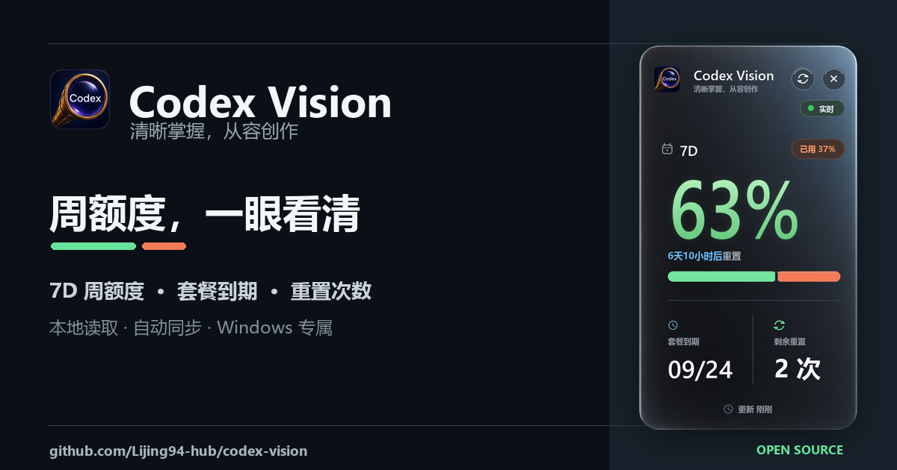
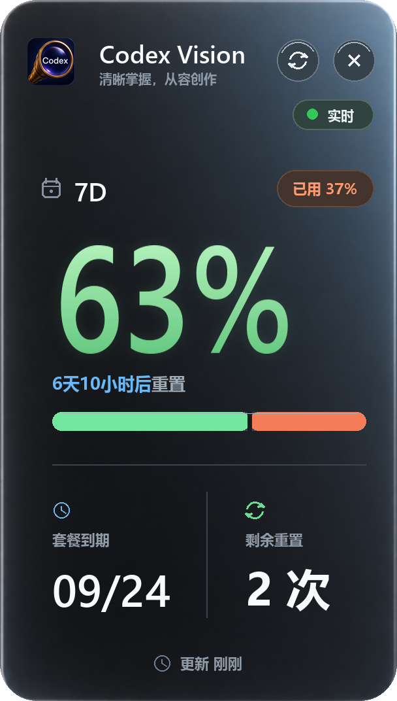
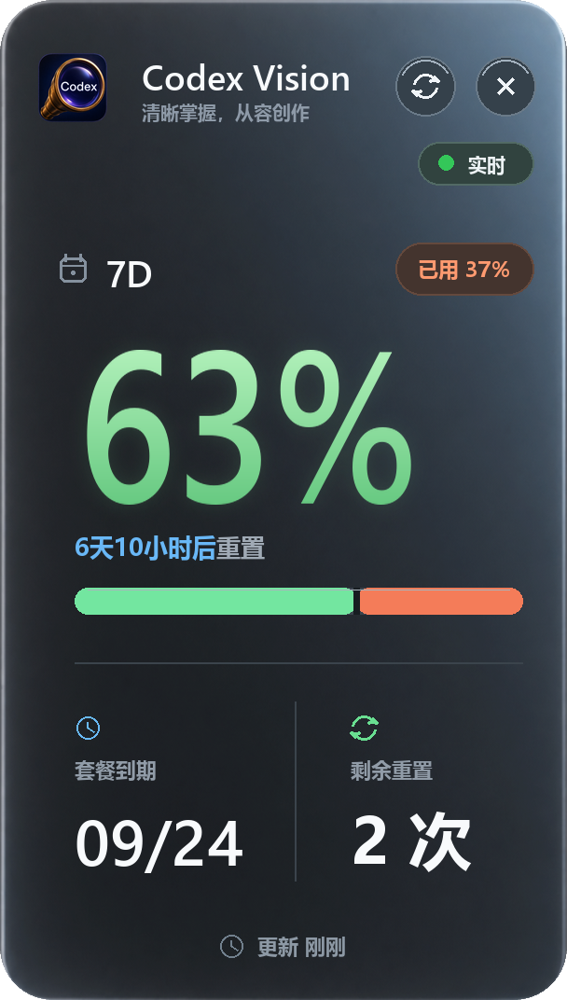
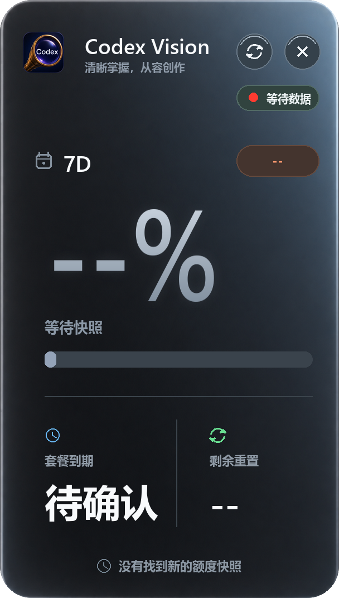
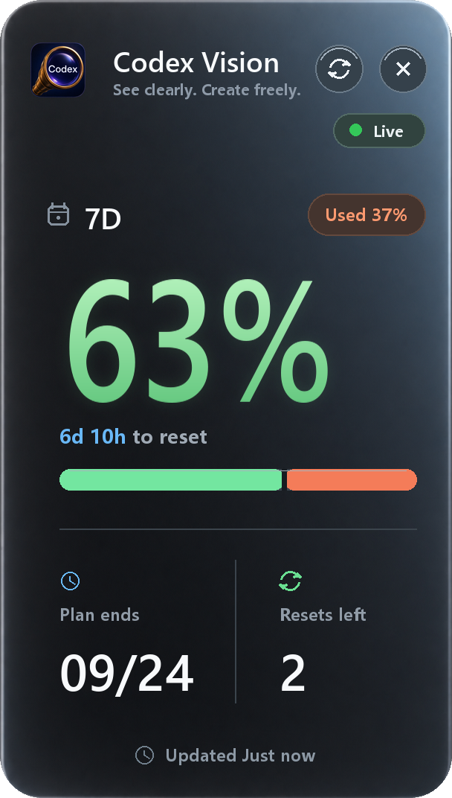

# Codex Vision

<p align="center">
  
</p>

<p align="center">
  <a href="https://github.com/Lijing94-hub/codex-usage-widget/releases/latest"></a>
  <a href="https://github.com/Lijing94-hub/codex-usage-widget/actions/workflows/tests.yml"></a>
  <a href="LICENSE"></a>
  
  <a href="https://github.com/Lijing94-hub/codex-usage-widget/stargazers"></a>
</p>

<p align="center">
  <strong>清晰掌握，从容创作。</strong><br>
  A focused Windows desktop widget for Codex weekly usage.
</p>

Codex Vision 把最重要的 Codex 用量信息放在桌面上：7D 周额度、下次重置、套餐到期时间和剩余重置次数。无需打开网页，也无需先运行一个 Codex 任务来触发刷新。

> Codex Vision 1.0 仅支持 Windows 10/11。macOS 产品线已经停止维护并从仓库移除。

## Download

[**Download CodexVision-Windows.zip**](https://github.com/Lijing94-hub/codex-usage-widget/releases/latest/download/CodexVision-Windows.zip)

解压后双击 `CodexVision.exe`。发布包自带 Python 运行环境，不需要另外安装依赖。

## Product Highlights

- **周额度自动同步**：优先通过本机 Codex app-server 获取新数据，无需启动任务；不可用时回退到本地额度记录。
- **状态始终可解释**：实时、缓存、等待和过期状态分别呈现，不用空白或错误数字掩盖数据来源。
- **套餐日期可确认**：支持从 ChatGPT、Apple 或 Google Play 官方账单页确认准确日期；只在本机保存日期和渠道。
- **重置次数更可信**：优先显示 Codex 返回的重置余额；无法取得时，才根据已确认套餐日期与 7D 周期估算。
- **桌面体验克制**：Windows 毛玻璃、悬停半透明、拖动定位、置顶开关，并且不占任务栏和 `Alt + Tab`。
- **本地优先**：本项目没有遥测、账号系统或自建服务器，也不会上传会话内容。
- **中英文自适应**：跟随 Windows 系统语言显示简体中文或英文。

## Screenshots

| Live | Hover glass | Waiting safely | English |
| --- | --- | --- | --- |
|  |  |  |  |

The screenshots use deterministic sample data generated by the production renderer. No interface elements are redrawn in a mockup.

## How It Works

Codex Vision uses a layered data strategy:

1. Ask the locally installed Codex app-server for the current rate-limit snapshot.
2. Fall back to `~/.codex/logs_2.sqlite` and recent `~/.codex/sessions/**/*.jsonl` rate-limit events.
3. Keep the last successful snapshot in `%APPDATA%\CodexUsageWidget\limit_sample.json` so a temporary read failure does not make the widget disappear.

The widget refreshes the display every few seconds, throttles app-server calls, and immediately checks again when Codex writes a new local record.

## Install

### Recommended

1. Download the latest Windows zip from [Releases](https://github.com/Lijing94-hub/codex-usage-widget/releases/latest).
2. Extract the complete folder.
3. Double-click `CodexVision.exe`.
4. Optional: run `install-startup.cmd` to start Codex Vision when you sign in.

Use `uninstall-startup.cmd` to remove the startup shortcut. The script does not delete settings or usage snapshots.

Windows SmartScreen may warn because the community build is not code-signed. Verify that the file came from this repository before choosing **Run anyway**.

### Controls

- Click the refresh icon to force a live sync.
- Click the close icon to exit completely.
- Drag the widget to reposition it.
- Hover to lower opacity and inspect content underneath.
- Right-click for refresh, plan-date sync, always-on-top, position reset, and quit.
- Click the plan section to confirm the exact billing date shown by your official billing provider.

## Privacy

Codex Vision does not send data to a service operated by this project. It requests rate-limit information from the locally installed Codex app-server and reads only rate-limit events from local Codex files. It does not display conversation text.

The billing confirmation flow opens the official provider page in your browser. Only the date and provider name are stored locally. Passwords, cookies and account tokens are not collected or copied into the widget cache.

## Build From Source

Requirements: Windows 10/11, Python 3.10+, and Pillow.

```powershell
py -m pip install -r requirements-dev.txt
python codex_usage_widget.py --test --include-ui
.\build-windows.cmd
```

Build outputs:

- `dist\CodexVision\CodexVision.exe`
- `dist\CodexVision-Windows.zip`

Documentation screenshots are reproducible:

```powershell
python tools\generate_docs_assets.py
```

## Known Boundaries

- This project is Windows-only and currently ships an unsigned community build.
- The exact subscription end date is not always exposed by Codex. When it is unavailable, the widget asks you to confirm the date shown by the official billing provider.
- Codex may change its local event format or app-server protocol. Cache fallback keeps the last valid value visible, but a future Codex update can still require a parser update.

## Contributing

Bug reports should include the Windows version, Codex Vision version, expected result and a screenshot with personal data removed. Never post `auth.json`, account tokens, cookies or conversation files.

See [CONTRIBUTING.md](CONTRIBUTING.md) for the development checklist and [SECURITY.md](SECURITY.md) for private vulnerability reporting guidance.

## License And Disclaimer

Released under the [MIT License](LICENSE).

Codex Vision is an unofficial community project and is not affiliated with or endorsed by OpenAI. Codex and OpenAI are trademarks of their respective owners.
